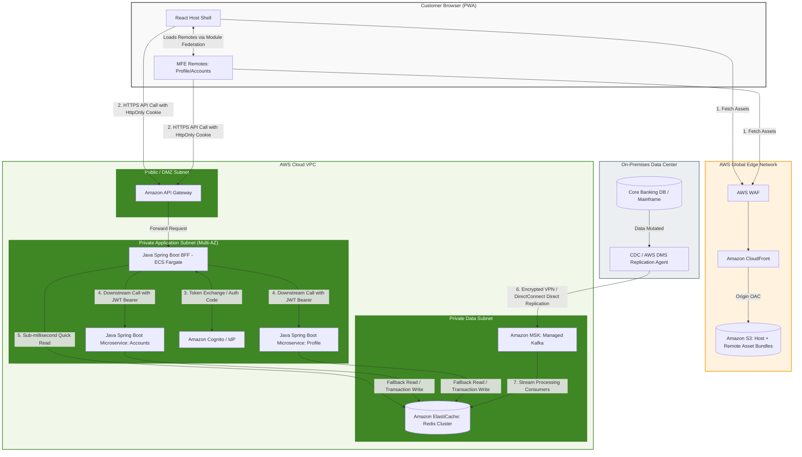
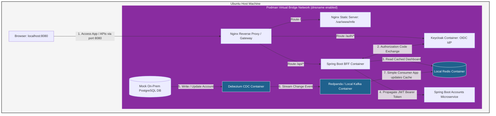

Productionizing an online banking user experience using **React Microfrontends (Module Federation + PWA)** backed by **Java Spring Boot microservices** requires a highly secure, resilient, and low-latency physical cloud architecture.

To address your requirements, the architecture isolates public-facing static content from private backend services using a **Backend-For-Frontend (BFF)** pattern, integrates robust **OAuth2/OIDC** security tokens, and implements a near-real-time **CQRS-style data platform** for rapid dashboard hydration.

---

## 1. Architectural Layers & AWS Services

### A. Edge & Frontend Hosting Layer

* **Amazon CloudFront & AWS WAF:** CloudFront serves as the Global Content Delivery Network (CDN) to distribute the React host (shell) application and independent remote microfrontends (PWA assets, `remoteEntry.js` files, and chunks). AWS WAF is attached to inspect traffic for top OWASP threats, DDoS, and cross-site scripting (XSS).
* **Amazon S3:** S3 buckets act as private origins for CloudFront. Using **Origin Access Control (OAC)**, public access to the buckets is blocked entirely. Each microfrontend is versioned and deployed to its own isolated directory or separate bucket.

### B. API Gateway & BFF (Backend-For-Frontend) Layer

* **Amazon API Gateway:** Acting as the entry point for all dynamic backend APIs. It handles rate limiting, CORS, and hooks natively into the security provider.
* **Spring Boot BFF (ECS Fargate):** Rather than exposing microservices directly to the browser, a dedicated Java Spring Boot BFF layer is deployed across multiple Availability Zones. This BFF maps downstream microservices, handles data aggregation to reduce client-side chattiness, manages PWA push notifications, and acts as a **Confidential Client** to secure authorization tokens.

### C. Core Microservices Layer

* **Java Spring Boot Services (Amazon ECS/EKS):** Core domains (e.g., Accounts, Transfers, Loans) run as containerized microservices managed via AWS Fargate. They communicate over a private, isolated VPC subnetwork.

### D. Cloud Data Platform & Hydration Layer

* **Amazon ElastiCache (Redis):** Serves as the near-real-time data platform cache. When the customer logs in, the initial dashboard metrics (Customer Profile, Accounts Summary) are served directly from Redis in sub-millisecond timelines.
* **AWS Database Migration Service (DMS) & Amazon MSK (Kafka):** To maintain real-time fidelity with the on-premise core banking systems without causing performance degradation on transactional databases, an event-driven replication loop is used:
1. On-prem data changes trigger Change Data Capture (CDC) via AWS DMS or an internal Kafka Connect pipeline.
2. Events are streamed securely to **Amazon MSK** in the cloud.
3. A consumer service updates **Amazon ElastiCache** immediately.


### E. Identity & Security Layer

* **Amazon Cognito / External Identity Provider (OIDC):** Handles customer authentication, password policies, and Multi-Factor Authentication (MFA).

---

## 2. Token-Based Authentication Flow

To maximize security for a banking app, the **Token Handler Pattern (or Backend-Channel Token pattern)** is used to avoid exposing sensitive OAuth Access Tokens (`jwt`) directly to client-side JavaScript storage:

1. **Customer Authentication:** The customer signs in via the React Host. The request passes through CloudFront and API Gateway to the Spring Boot BFF. The BFF interacts with Amazon Cognito/IdP to complete the OIDC flow.
2. **Securing the Frontend:** Upon successful authentication, the IdP returns tokens (ID, Access, Refresh) to the BFF. The BFF handles these securely in memory and drops an **HttpOnly, Secure, SameSite=Strict cookie** back to the customer's browser.
3. **Microfrontend-to-BFF Calls:** Whenever a React remote module fetches data, it sends requests implicitly passing the secure session cookie. API Gateway forwards this to the BFF.
4. **BFF-to-Microservices Calls:** The BFF intercepts the cookie, resolves it to the customer's actual OAuth `Bearer JWT Access Token`, and injects it into the HTTP header of downstream REST or gRPC requests. Microservices validate this token signature public key locally or via a caching mechanism.

---

## 3. Physical Architecture Diagram (Mermaid)

The architecture diagram below visualizes the physical partitioning, the boundaries of the AWS VPC, and the real-time data ingestion loop from the on-premise datacenter.



---

## 4. Operational Considerations for Production

* **PWA Cache Control Strategy:** Set the cache header of `remoteEntry.js` to `Cache-Control: no-store, no-cache, must-revalidate`. This forces the client browser to immediately pull the newest remote entry configuration whenever a microfrontend deployment takes place. The associated application chunks can be hashed and cached permanently (`Cache-Control: max-age=31536000`).
* **Resiliency on Data Ingestion:** If AWS DMS or Amazon MSK experiences a localized connection breakdown to the on-premise environment, the cloud architecture defaults back to read-through behavior on the Spring Boot Microservices, querying directly through an **AWS Direct Connect** or site-to-site VPN to prevent data rendering gaps on the customer dashboard.
* **Blast Radius Isolation:** Deploy each remote microfrontend with its own isolated CI/CD pipeline. When an update is deployed to S3, a focused invalidate command is targeted directly to that subdirectory on CloudFront (`aws cloudfront create-invalidation --paths "/mfe-profile/*"`), maintaining complete uptime for alternative operational remotes.

---
---

To transition this cloud-scale architecture to a local development environment on an Ubuntu machine using **Podman**, we need to replace AWS managed services with open-source equivalents.

Since Podman runs rootless by default, we will organize the services using a multi-container setup via `podman-compose` or `podman play kube`, leveraging a shared local network for secure container-to-container communication.

---

## 1. Local Architecture Mapping (AWS to Podman)

To mirror the production behavior on your laptop, the AWS services map to the following local open-source containers:

| AWS Component | Local Podman Equivalent | Purpose in Local Dev |
| --- | --- | --- |
| **CloudFront / WAF / API Gateway** | **Nginx / Envoy** | Acts as the reverse proxy, manages routing for local MFEs, handles SSL termination, and simulates cross-origin limits. |
| **S3 (Static Assets)** | **Nginx Local Directory or MinIO** | Serves the compiled React host shell and federated remote assets (`remoteEntry.js`). |
| **Spring Boot BFF & Microservices** | **Java Spring Boot Containers** | Packaged as local container images running in the same Podman network. |
| **Amazon Cognito** | **Keycloak** | Open-source Identity Provider to test full OAuth2/OIDC code grants and HttpOnly cookie generation. |
| **Amazon ElastiCache (Redis)** | **Redis OSS Image** | Local key-value store for dashboard hydration testing. |
| **Amazon MSK & AWS DMS** | **Redpanda (or Kafka) + Debezium** | Simulates Change Data Capture (CDC) and the streaming data hydration loop locally. |

---

## 2. Local Architecture Topology Diagram

This diagram visualizes how the components interact locally inside your Ubuntu Podman environment.



---

## 3. Podman Local Implementation Details

### A. Configuring Rootless Podman Networking

By default, rootless Podman containers cannot communicate with each other using default container IDs unless they share a user-defined network. Ensure you have the `podman-plugins` (or `containernetworking-plugins`) package installed on Ubuntu so that container-to-container DNS resolution works.

```bash
# Create a dedicated network for your local banking cluster
podman network create banking-net

```

### B. Local `podman-compose.yml` Structure

Below is a foundational structure to spin up the local environment, ensuring that the Spring Boot applications, Keycloak, and Redis share the same local network context.

```yaml
version: '3.8'

networks:
  banking-net:
    external: true

services:
  # Local Security / IdP
  keycloak:
    image: quay.io/keycloak/keycloak:latest
    args: ["start-dev"]
    environment:
      - KEYCLOAK_ADMIN=admin
      - KEYCLOAK_ADMIN_PASSWORD=admin
      - KC_HEALTH_ENABLED=true
    ports:
      - "8081:8080"
    networks:
      - banking-net

  # Local Near-Real-Time Hydration Data Cache
  local-cache:
    image: docker.io/library/redis:7-alpine
    ports:
      - "6379:6379"
    networks:
      - banking-net

  # Local Edge / Web Server simulating CloudFront & API Gateway
  local-gateway:
    image: docker.io/library/nginx:alpine
    ports:
      - "8080:80"
    volumes:
      - ./nginx.conf:/etc/nginx/nginx.conf:ro
      - ./dist:/var/www/mfe:ro # Contains your Host and Federated Remote built JS files
    networks:
      - banking-net
    depends_on:
      - bff
      - keycloak

  # Spring Boot Backend-For-Frontend (BFF)
  bff:
    image: localhost/spring-boot-bff:latest # Built locally via 'podman build'
    environment:
      - SPRING_DATA_REDIS_HOST=local-cache
      - SPRING_SECURITY_OAUTH2_RESOURCESERVER_JWT_ISSUER_URI=http://keycloak:8080/realms/banking
    networks:
      - banking-net
    depends_on:
      - local-cache
      - keycloak

```

### C. Simulating the Token Handler Flow Locally

1. **Nginx Configuration (`nginx.conf`):** Configure Nginx to proxy `/api/` requests straight to the `bff` container, and `/auth/` requests straight to `keycloak`.
2. **Local Hosts Mapping:** To avoid cross-domain cookie issues when testing the **HttpOnly Cookie pattern** locally, map a dummy domain in your Ubuntu `/etc/hosts` file:
```text
127.0.0.1   banking.local

```


You can then access your local environment via `http://banking.local:8080`. This allows your local React host app and the Spring Boot BFF container to share the `banking.local` domain, satisfying `SameSite=Strict` cookie restrictions perfectly during development.
3. **Token Verification:** The local core microservice (e.g., `MS_Accounts`) validates incoming requests by fetching the JWT public signing keys from `http://keycloak:8080/realms/banking/protocol/openid-connect/certs` over the internal Podman bridge network.

---
---
Yes, Redis is an excellent fit for this specific banking use case, but it should be used as a speed layer (cache) rather than the permanent golden record. [1] 
For a bank with 600,000 customers, the total data size for names, account numbers, nicknames, and balances is actually quite small (under 3 to 5 gigabytes of total RAM). Because Apache Kafka and [Change Data Capture (CDC)](https://www.geeksforgeeks.org/system-design/change-data-capture-cdc/) will be constantly streaming live balance updates from the mainframes, [Redis](https://redis.io/) can ingest those updates instantly. This allows mobile banking apps and websites to show customers their live balances in under a millisecond without crashing the mainframes.
------------------------------

## Why Redis is a Great Fit here

* 
* Sub-Millisecond Updates: When a customer swipes their debit card, the mainframe triggers a CDC event through Kafka. Redis can update that specific customer's balance instantly.
* Low Memory Footprint: 600,000 customers with a few accounts each will easily fit into a small, inexpensive Redis cluster.
* Native Data Structures: You can use Redis Hashes to store each account (account_number, nickname, type, balance) linked to a Redis Set of the customer's ID. [2, 3] 
* 

## The Catch: Why You Need a Twin Platform
While Redis handles the fast live updates perfectly, it is not a good fit for the permanent storage of a bank. It is expensive for long-term historical data, and it is difficult to run complex audits or monthly financial reports on it. [4, 5, 6] 
------------------------------
## The Most Appropriate Cloud Alternatives
To build a secure, scalable banking system, companies use a hybrid approach. They use Redis for the fast live screen views, alongside one of the following permanent cloud platforms: [7, 8] 

| Cloud Provider [9, 10, 11, 12, 13] | NoSQL Database (For the Live App) | Data Lakehouse (For Analytics & History) |
|---|---|---|
| AWS | Amazon DynamoDB | Amazon S3 + Databricks / AWS Glue |
| Microsoft Azure | Azure Cosmos DB[](https://azure.microsoft.com/en-us/products/cosmos-db/) | Azure Data Lake + Databricks |
| Google Cloud | Google Cloud Bigtable[](https://cloud.google.com/bigtable) / Firestore | Google Cloud Storage + BigQuery / Databricks |

## 1. The Operational Choice: Managed Cloud NoSQL
If you choose not to use Redis, tools like Amazon DynamoDB or [Azure Cosmos DB](https://azure.microsoft.com/en-us/products/cosmos-db) are the best alternatives. [14] 

* 
* Pros: They can easily handle the rapid streaming updates from Kafka, scale automatically, and store data safely on physical disks instead of expensive RAM.
* Cons: They are slightly slower than Redis (single-digit milliseconds vs. sub-milliseconds). [15, 16] 
* 

## 2. The Analytical Choice: Cloud Data Lakehouse (Databricks) [17] 
Your Kafka stream should send a second copy of the data to a platform like Databricks. [18] 

* 
* Pros: It provides a permanent, highly secure record of every balance change over time. It is perfect for data scientists running fraud detection or analysts creating monthly financial compliance reports.
* Cons: It is not designed to serve instant balance updates directly to a customer-facing mobile app. [19] 
* 

------------------------------
To help design the best architecture, tell me:

* 
* Which cloud provider (AWS, [Azure](https://www.techtarget.com/searchcloudcomputing/definition/Windows-Azure), or [Google Cloud](https://cloud.google.com/)) is your bank using?
* Will this data platform also need to serve historical data and analytics, or just live app views? [20] 
* 


[1] [https://medium.com](https://medium.com/@janinduravishka1999/how-redis-caching-supercharged-database-reads-in-spring-boot-cqrs-architecture-be1bfc77209a)
[2] [https://ak67373.medium.com](https://ak67373.medium.com/redis-a-high-speed-database-cache-and-message-broker-cb9fde351752)
[3] [https://www.acte.in](https://www.acte.in/redis-interview-questions-and-answers)
[4] [https://news.ycombinator.com](https://news.ycombinator.com/item?id=37552085)
[5] [https://redis.io](https://redis.io/blog/redis-data-integration-your-fast-lane-from-legacy-systems-to-the-ai-era-on-aws/)
[6] [https://www.chegg.com](https://www.chegg.com/homework-help/questions-and-answers/imagine-scenario-rapidly-growing-e-commerce-company-crossroads-data-management-strategy-de-q131933102)
[7] [https://sdk.finance](https://sdk.finance/blog/hybrid-cloud-for-banking/)
[8] [https://fptsoftware.com](https://fptsoftware.com/resource-center/blogs/cloud-banking-how-cloud-computing-is-transforming-the-bfsi-industry)
[9] [https://medium.com](https://medium.com/amsterdam-standard/dynamodb-to-use-or-not-to-use-7ccf44aea659)
[10] [https://quizlet.com](https://quizlet.com/473142351/chapter-2-1-50-domain-2define-performant-architectures-flash-cards/)
[11] [https://medium.com](https://medium.com/google-cloud/building-scalable-mobile-banking-solutions-on-gcp-8dad44ecb4a1)
[12] [https://www.linkedin.com](https://www.linkedin.com/pulse/data-bricks-certified-engineer-associate-dumps-ankit-yadav--3xs6f)
[13] [https://www.generativevalue.com](https://www.generativevalue.com/p/a-primer-on-the-data-lakehouse)
[14] [https://www.examtopics.com](https://www.examtopics.com/discussions/amazon/view/53854-exam-aws-certified-solutions-architect-associate-saa-c02/)
[15] [https://blogs.oracle.com](https://blogs.oracle.com/nosql/speed-matters-why-choosing-the-right-database-is-critical-for-best-customer-experience)
[16] [https://shiftasia.com](https://shiftasia.com/community/understanding-nosql-advantages-and-real-world-use-cases/)
[17] [https://mantelgroup.com.au](https://mantelgroup.com.au/what-is-databricks-and-whats-it-used-for/)
[18] [https://medium.com](https://medium.com/@24chynoweth/data-streaming-at-scale-databricks-and-snowflake-ca65a2401649)
[19] [https://www.databricks.com](https://www.databricks.com/customers/hsbc)
[20] [https://www.altisconsulting.com](https://www.altisconsulting.com/data-and-analytics/consulting-services/data-platforms)


---
---

Adding this supplementary data changes your needs. This new data includes text, dates, images, and expiry times. Some of it needs to be searched quickly, and some of it needs to disappear automatically when a sale or alert ends.
Because of this, Redis goes from being a good fit to being the perfect fit for the live app layer. However, you will need to structure it carefully.
------------------------------
## How Redis Handles This Supplementary Data
Redis has built-in features made specifically for things like alerts, promotions, and notifications:

* Automatic Expiration (TTL): You can set a "Time to Live" (TTL) on an alert or promotion. For example, if a marketing campaign ends on Friday, you can tell Redis to delete it automatically on Friday night. This keeps your database clean without any extra coding. [1, 2] 
* Pub/Sub (Publish/Subscribe): If a mainframe trigger sends a fraud warning to Kafka, Redis can instantly push that critical alert to the customer's phone in real-time.
* Fast Text Search: By using Redis Search, your app can quickly find all active promotions that match a specific customer type (like "Premium Account deals").

------------------------------
## The New Architecture Layout
Since you are adding more data types, you should organize your Redis platform into three distinct sections:

[ Kafka Stream ] ───► [ REDIS MEMORY PLATFORM ]
                           │
                           ├──► 1. Customer & Balance Layer (Fast updates)
                           ├──► 2. Alert & Notification Layer (Auto-expires via TTL)
                           └──► 3. Marketing & Promotion Layer (Indexed for fast search)


   1. Customer & Balance Layer: Still stores the live account numbers and balances using Redis Hashes.
   2. Alert & Notification Layer: Stores temporary items like "Low Balance Warning" or "New Login Detected." These use a TTL so they disappear after the customer reads them or after a few days. [3] 
   3. Marketing & Promotion Layer: Stores active ads and product discounts. These are indexed so the app can show relevant deals the moment a user logs in.

------------------------------
## When to Look at Cloud Alternatives Instead
While Redis handles this beautifully at 600,000 customers, you might want to look at a cloud alternative like Amazon DynamoDB or Azure Cosmos DB if:

* Rich Asset Storage: Your marketing promotions include large images or video banners. Redis should only store the text and links to those files, not the heavy images themselves.
* Complex Targeting: You want to run massive data science models to figure out which customer gets which ad. For that, you would need to feed this data back into an analytics platform like [Databricks](https://www.databricks.com/) to do the heavy lifting, then push the results back to Redis.

To help tailor this setup, let me know:

* Do these promotions include large files like images, or just text and links?
* How often do the marketing campaigns and alerts change or get updated?


[1] [https://umnico.com](https://umnico.com/blog/marketing-messages-lite-api/)
[2] [https://www.heltar.com](https://www.heltar.com/blogs/what-is-metas-mm-lite-api)
[3] [https://danlevy.net](https://danlevy.net/quiz-in-the-aws-cloud/)

